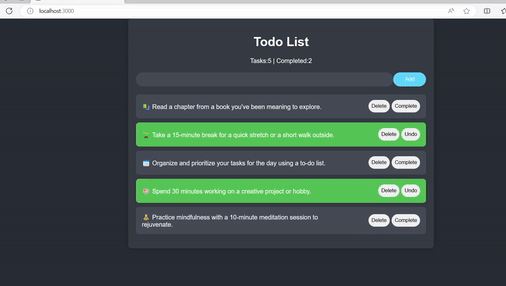

## ✨ Welcome to the To-Do-List React App! ✨

Get ready to dive into the magic of the `useEffect` hook as it transforms your to-do list experience. This React app is not just about tasks—it's about dynamic visual feedback, seamless local storage synchronization, and real-time task count updates.

### Key Features:

1. **Local Storage Sync: 🔄**
   - Leverage `useEffect` to seamlessly sync your task data with local storage.
   - Never worry about losing your to-do list, even after a page refresh. 💾

2. **Visual Feedback with Flash Effect: ✨**
   - Experience the satisfying visual feedback of a subtle flash when adding or completing a task.
   - Dynamic background color changes add an extra layer of interaction. 🎨

3. **Task Count Updates: 📊**
   - Watch as the completed tasks count updates in real-time.
   - `useEffect` ensures that your task statistics stay current without the need for a page reload. 🔄

### How it Works:
Explore the magic of `useEffect` in action by checking out the [code](https://github.com/prakharAgr2001/todolistwithFlash) on GitHub. See how it effortlessly adds efficiency and cleanliness to your React project.

### Try It Yourself!
Feel the magic firsthand and try out the To-Do-List app [here](https://todolistwith-flash.vercel.app/). Add, complete, and watch as the dynamic features enhance your productivity!

### Share Your Insights!
How do you wield the power of `useEffect` in your React projects? Share your tips and tricks in the comments below!

Happy coding, and let the `useEffect` magic unfold in your projects! 🚀✨ #ReactJS #WebDevelopment #CodingLife #UseEffectMagic
